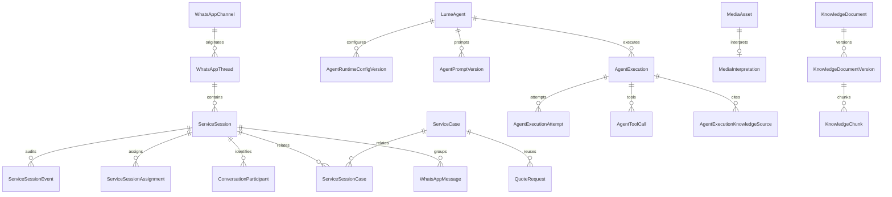

# Fundação de dados da reconstrução de atendimento

Este documento descreve a fundação **aditiva** introduzida pela migration
`20260829000100_whatsapp_reconstruction_foundation`. Ela não troca ainda os
controllers do atendimento. O fluxo legado continua sendo a fachada de
compatibilidade enquanto o webhook e o repository fazem dual-write dos novos
agregados.

## Princípios

- `company_id` participa das FKs entre entidades tenant-owned. Uma referência
  que pertence a outro tenant é rejeitada pelo banco.
- Nenhuma tabela, conversa, mensagem, importação ou quote legado é removido.
- Inbound, outbox, tentativas Evolution e importações continuam nas tabelas
  existentes.
- Canal, sessão, execução de agente, versões publicadas e reviews são retidos;
  lifecycle usa status/close/archive/cancel/disable, não delete físico.
- `WhatsAppChannel.instanceName` e a origem de uma `ServiceSession` são
  imutáveis no banco.
- OpenAI é o único provider registrado e utilizável nesta entrega. O provider é
  persistido como identificador extensível e só pode executar quando houver um
  adapter explicitamente registrado pela plataforma, preservando a evolução
  futura sem aceitar configurações desconhecidas hoje. Cada versão de runtime
  aponta para um `credentialRef` server-side individual; nenhum secret é
  persistido.

## Agregados

### Canal

`WhatsAppChannel` mantém os campos legados e adiciona:

- `version`, criador e departamento proprietário;
- `routingMode` (`DEPARTMENT_OWNED` ou `GENERAL_TRIAGE`);
- status organizacional separado do status de conexão;
- identificador Evolution opcional, mantendo `instanceName` técnico;
- destinos departamentais permitidos para roteamento automático;
- `WhatsAppChannelEvent`, ledger append-only com `commandId`, fingerprint,
  `expectedVersion`, versão resultante, ator e snapshots before/after.

O telefone possui índice único global. A migration faz preflight e falha sem
alterar dados se encontrar duplicatas. Números de grupos permanecem em
`WhatsAppGroup.whatsappId` e não participam desse índice.

Novos canais recebem `ignoreFromMe=false` e `ignoreGroups=false`: mensagens
enviadas pelo WhatsApp App precisam ser classificadas como takeover humano, e
grupos precisam ser sincronizados mesmo com IA desligada. A migration altera
somente os defaults; preferências já persistidas dos canais legados não são
reescritas.

A migration não atualiza `instance_name`. Assim, a instância operacional
existente `milenium-production` conserva exatamente o mesmo nome e registro.
Um trigger impede renomeá-la depois da migration.

### Thread, sessão e processo

- `WhatsAppThread` representa permanentemente canal + contato.
- `ServiceSession` representa um episódio e separa `status`, `controlMode`,
  departamento, responsável, fila e prioridade.
- `ServiceSessionAssignment` guarda a trilha de atribuição.
- `ServiceSessionEvent` é o ledger idempotente de toda mutação de sessão,
  incluindo takeover, return-to-AI, prioridade e fechamento.
- `ConversationParticipant` preserva a hipótese/confirmação de identidade
  daquela sessão sem transformar `WhatsAppContact` em cadastro.
- `ServiceCase` separa processo de negócio do atendimento. Quotes continuam em
  `QuoteRequest`; o Case apenas as referencia.

Há no máximo uma sessão foreground não fechada por thread e um assignment
ativo por sessão. O código público de continuidade e sua expiração precisam
ser gravados juntos.

### Agentes

`LumeAgent` é platform-managed e recebe capabilities/tools por relações
explícitas. Prompt e runtime são versões imutáveis. A configuração de runtime
contém somente:

- provider efetivo (atualmente `openai`, validado pelo adapter registrado);
- modelo OpenAI;
- `credentialRef` (`env://...` ou `docker-secret://...`);
- identificador/versão segura da credencial;
- parâmetros permitidos.

`AgentExecution` registra agente e tipo, sessão, versão exata de runtime,
versões de prompt, provider/model efetivos, tokens, latência, resultado
estruturado e erro. Attempts, tool calls, fontes da Knowledge Base e
interpretações de mídia ficam em tabelas próprias. Raciocínio privado e secret
não possuem campo no modelo.

### Mídia, conhecimento e cadastro

- Mídia legada é projetada em `MediaAsset` sem mover o arquivo nem apagar as
  colunas antigas.
- Existe no máximo uma `MediaInterpretation` por asset. Correção humana é uma
  entidade separada e não provoca reanálise.
- Vídeo pode ser retido, mas o banco só aceita marcador `UNSUPPORTED`, não uma
  análise de IA.
- Knowledge Base possui scope/visibilidade, documentos, versões, chunks,
  sugestões e gaps. Versões não draft e seus chunks são imutáveis.
- Cada fonte usada por um agente aponta para a versão/chunk exatos recuperados.
- `RegistrationDataReview` registra divergência organizacional estruturada e
  liga Registration, contato, sessão, execução e revisor.
- `RegistrationPhone.whatsappContactId` passa a ter FK composta tenant-safe. A
  migration falha antes da criação da FK caso existam referências inválidas.

### Grupos

`WhatsAppGroup`, participantes e mensagens formam uma infraestrutura separada.
O modo padrão é `OFF`. Não existe FK de grupo para `ServiceSession`, portanto
mensagem de grupo não abre atendimento individual nem entra no runtime dos
novos agentes nesta fase. A flag legada `ignoreGroups` não descarta mais
eventos recebidos: grupos e participantes são preservados mesmo quando essa
preferência antiga ainda estiver gravada, sempre sem automação individual.
Quando o telefone de um participante possui exatamente um vínculo cadastral
ativo no mesmo tenant, o vínculo é reaproveitado; ausência ou ambiguidade
mantém `linkedRegistrationId=null` e nunca cria um Registration.

## Slice de ingestão e dual-write

O repository legado agora mantém, na mesma transação, a projeção mínima da
reconstrução:

- inbound direto garante `WhatsAppThread` e uma `ServiceSession` foreground e
  liga mensagens, transições, quotes e documentos aos dois agregados;
- inbound usa `CUSTOMER/WHATSAPP_APP`; envio pelo painel usa
  `HUMAN_USER/LUME_WEB`; um `fromMe` sem mensagem Lume prévia usa
  `EXTERNAL_HUMAN/WHATSAPP_APP` e muda a sessão para `HUMAN` com evento
  versionado;
- candidatos de identidade são copiados de `RegistrationPhone` para
  `ConversationParticipant` antes da primeira resposta, sem criar Registration
  e sem publicar os IDs candidatos;
- decisão, criação e claim de saída automática relêem a sessão sob lock. Uma
  sessão humana, fechada, não foreground ou que não seja a sessão ativa falha
  fechada;
- mensagens e eventos de grupo atualizam somente `WhatsAppGroup`, participantes
  e mensagens, sempre com IA `OFF` e sem conversa/thread/sessão individual.

O ledger `ServiceSessionEvent` registra criação e mudanças feitas pelo
dual-write com `commandId`, fingerprint, expected/resulting version, ator e
snapshots. A fachada, menus, outbox e tabelas legadas permanecem operacionais.

## Encerramento e continuidade

O fechamento automático não é inferido do texto ou do estado do quote. O
worker `ServiceSessionLifecycleWorker` considera somente sessão foreground em
controle `AI`, explicitamente marcada com `conversationResolved=true`, com
`pendingActions=[]` e sem entrega/proposta pendente. Ele grava a sessão como
`CLOSING`, a pergunta fixa “Precisa de mais alguma coisa?”, a tentativa pending
e a outbox na mesma transação. O prazo persistido é exatamente 30 minutos.

Uma mensagem inbound durante `CLOSING` reabre a sessão antes de persistir a
mensagem, zera a resolução e registra evento versionado. O claim Evolution da
pergunta relê a sessão sob os mesmos locks e falha fechado quando essa pergunta
ficou obsoleta. Ao vencer o prazo, somente uma pergunta já enviada permite o
fechamento. Sessão, conversa legada, transição, mensagem final e outbox são
atualizadas atomicamente.

O código público possui exatamente três dígitos, expira sete dias após o
fechamento e é único dentro do tenant. A busca de `CONTINUAR 845` exige o mesmo
`companyId` e a mesma Thread (canal + contato), portanto outro número não recebe
qualquer sinal de que o código existe. Códigos expirados só são reutilizados
depois de serem removidos da sessão anterior com novo evento auditável.

Sem código válido, a sessão encerrada há menos de duas horas é reaberta
provisoriamente como `UNCERTAIN/REOPEN_PREVIOUS`, para que a mensagem seja
persistida antes de qualquer automação. Ao consumir a outbox, o agente de
plataforma `continuity-classifier` usa exclusivamente seu runtime/credencial do
tenant e classifica silenciosamente antes do lote e do agente customer-facing.
`CONTINUATION` mantém a sessão anterior; `UNCERTAIN` mantém a reabertura segura;
`NEW_SUBJECT` fecha novamente a anterior, cria uma nova sessão relacionada e
move para ela as mensagens/transições do novo episódio e os participantes
ativos necessários à resolução de identidade. Departamento sugerido só é
aceito quando pertence ao tenant e à allowlist automática do canal.

Classificação, confiança, motivo, fallback, departamento alvo e a execução do
agente são gravados em `ServiceSessionContinuityDecision`. A mutação usa lock,
`commandId`, `expectedVersion`, fingerprint e `ServiceSessionEvent` com
snapshots. Falha de runtime, credencial ou payload inválido produz
`UNCERTAIN/REOPEN_PREVIOUS`; quando houve uma execução durável, seu ID também é
preservado. `CONTINUAR NNN` válido e contato após duas horas permanecem
determinísticos e não chamam modelo. Depois de duas horas nasce uma nova sessão
na mesma Thread/sourceChannel sem relação semântica inventada com a anterior.

## Backfill legado

O backfill reutiliza UUIDs para manter rastreabilidade:

| Legado                           | Fundação                     |
| -------------------------------- | ---------------------------- |
| `WhatsAppConversation.id`        | `WhatsAppThread.id`          |
| `WhatsAppConversation.id`        | primeira `ServiceSession.id` |
| `WhatsAppMessage.id` não textual | `MediaAsset.id`              |
| `QuoteRequest.id`                | `ServiceCase.id`             |

Estados antigos são projetados assim:

| `ConversationState`    | `ServiceSession.status` | `controlMode` |
| ---------------------- | ----------------------- | ------------- |
| `bot-active`           | `OPEN`                  | `AI`          |
| `waiting-for-customer` | `WAITING_CUSTOMER`      | `AI`          |
| `sent-to-human`        | `WAITING_HUMAN`         | `HUMAN`       |
| `human-active`         | `OPEN`                  | `HUMAN`       |
| `closed`               | `CLOSED`                | `AI`          |

A consolidação anterior já unificou episódios históricos na conversa canônica.
Por isso o backfill cria conscientemente **uma** sessão legacy por conversa; ele
não inventa limites históricos. Mensagens, transições, quotes e documentos são
ligados a essa sessão nullable, mantendo as relações legadas simultaneamente.

## Implantação e verificação

1. Fazer backup e executar a migration em staging.
2. Se o preflight de telefone ou contato falhar, corrigir os dados de forma
   explícita e reaplicar; nunca remover linhas automaticamente.
3. Conferir que as contagens de threads e sessões legacy são iguais às de
   conversas canônicas.
4. Conferir que todos os `instance_name` são idênticos aos valores anteriores.
5. Conferir mensagens/quotes com `thread_id` ou `service_session_id` nulos; após
   o backfill, isso só deve ocorrer em novas gravações ainda feitas pela fachada
   legada.
6. Só implantar o código de dual-write depois que esta migration tiver sido
   aplicada com sucesso no mesmo ambiente.

Não há migration destrutiva de down. Qualquer correção deve ser feita por uma
nova migration forward-only, preservando evidências e IDs.

## Limitações desta fase

- O dual-write continua encapsulado no repository legado para compatibilidade,
  enquanto os endpoints versionados de canais e ServiceSessions expõem as novas
  operações sem obrigar consumidores antigos a migrar de uma vez.
- QR, regeneração, disconnect e reconnect usam a mesma instância imutável da
  Evolution; cancelamento/desativação continuam estados sem delete físico.
- O `PlatformWhatsAppConversationAgent` está registrado no `WhatsAppModule` e
  executa o runtime de agentes no consumidor da outbox.
- A classificação silenciosa ocorre no consumidor transacional da outbox, não
  dentro da transação do webhook; a sessão e as mensagens são corrigidas antes
  de qualquer agente customer-facing ou envio automático.
- As colunas nullable mantêm compatibilidade até o dual-write estar estável;
  só então poderão ser tornadas obrigatórias por migration separada.
